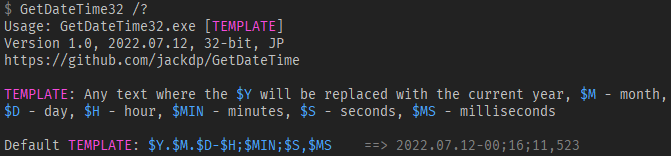

# GetDateTime

A very small console application that displays the current date and time in a user-specified format.

I have been using this program for many years when creating backups.


## Usage

Usage: `GetDateTime32.exe [TEMPLATE]`

**TEMPLATE**: Any text where the `$Y` will be replaced with the current year, `$M` - month, `$D` - day, `$H` - hour, `$MIN` - minutes, `$S` - seconds, `$MS` - milliseconds

Default TEMPLATE: `$Y.$M.$D-$H;$MIN;$S,$MS`

The default template does not contain any characters that are not allowed in file names.




## Examples

### Save the current time to the variable "dt" in a batch file

#### Method 1 - default template (without spaces)

```batch
for /f %%i in ('GetDateTime32.exe') do set dt=%%i
echo %dt%
```

#### Method 2 - template with spaces

```batch
set temp_file=%TMP%\_temp_%RANDOM%.txt
GetDateTime.exe "Date: $Y.$M.$D   Time: $H:$MIN:$S.$MS" > %temp_file%
set /p dt=<%temp_file%
del %temp_file%

echo %dt%
```

### Unique filename for archiving purposes

```batch
for /f %%i in ('GetDateTime32.exe') do set dt=%%i
set BackupFile=backup_%dt%.7z
set SevenZip=7z.exe
set Files=*.pas *.pp *.dpr *.lpr *.dproj *.lpi *.dfm *.lfm *.res
set ComprThreads=4
set ComprLevel=8

%SevenZip% a -r -mx=%ComprLevel% -t7z -m0=LZMA2 -scsUTF-8 -mmt=%ComprThreads% -mtc=on -mtm=on -mta=on %BackupFile% %Files%
```

## Compilation

You need:

1. Lazarus IDE <https://www.lazarus-ide.org/>
1. JPLib <https://github.com/jackdp/JPLib>

Lazarus project file: `src\GetDateTime.lpi`

## License

Public domain.